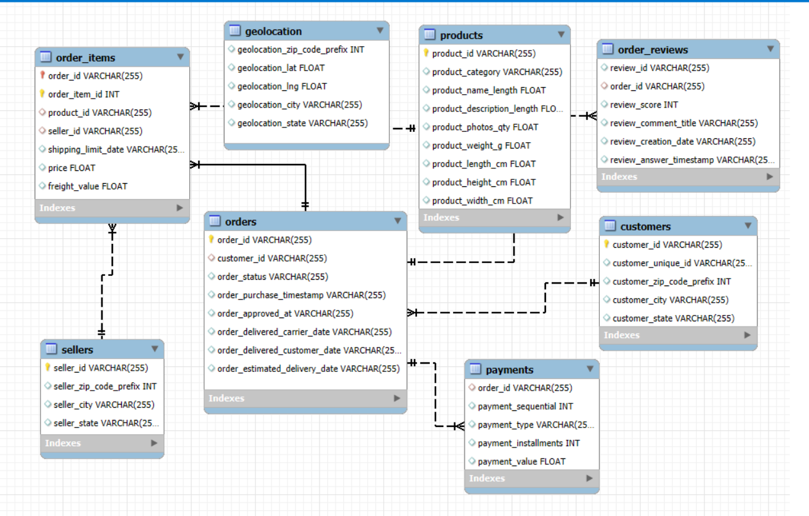

# 🛒 Target E-Commerce SQL Project
_SQL-based analysis on Target Retail Dataset with ERD, insights, and business solutions._

This project performs a complete end-to-end SQL analysis on a real-world Target e-commerce dataset. The goal is to understand customer behavior, order performance, product insights, payments, seller activity, and business growth trends. The dataset contains thousands of records such as customers, orders, products, sellers, geolocations, reviews, and payments.

## 🎯 Objectives
- Analyze customer behavior and retention  
- Measure order & delivery performance  
- Identify top-selling products and categories  
- Evaluate payment methods and revenue contribution  
- Analyze seller performance  
- Study customer satisfaction  
- Track monthly revenue growth and trends  

## 🧩 Tech Stack Used
- **MySQL** – Database & SQL queries  
- **Python (Pandas + MySQL Connector)** – Data import automation  
- **PowerPoint** – Presentation  
- **GitHub** – Project hosting  

## 🛠️ Project Structure
```
target-ecommerce-sql-project/
│
├── sql/
│ ├── 1.database setup.sql
│ ├── 2.relationships.sql
│ ├── 3.python to sql connection.ipynb
│ └── 4.analysis queries.sql
│
├── data/
│ ├── data.zip
│ └── readme.md
│
├── ppt/
│ └── final_presentation.pptx
│
├── outputs/
│ ├── ERD.png
│ ├── screenshots
│ └── charts
│
└── README.md
```


## 🗂️ Dataset Source
This project uses a publicly available **Target Retail E-Commerce Dataset**, containing real transaction-level data.

## 📊 ERD Diagram



## 🧪 Key Analyses Performed

### Customer Analysis
- Count of unique customers  
- Top 5 states with highest customers  
- Customer retention rate  
- Customers with frequent low ratings  

### Order & Delivery Analysis
- Delivered vs canceled orders  
- Average delivery time  
- Fastest delivery cities  
- Late delivery percentage  
- Monthly order counts  

### Product & Category Analysis
- Top 10 most sold categories  
- Category-wise product dimensions  
- Freight-to-price ratio  
- Top 3 products per category by revenue  

### Payment & Revenue Analysis
- Most used payment type  
- Revenue by payment type  
- Highest-value orders  
- Average installments (credit card)  

### Review Analysis
- Average review score per category  
- Sellers with more than 3 low ratings  
- Delivery time vs review score correlation  
- Review distribution by state  

### Seller & Location Analysis
- Sellers per state  
- Sellers with highest revenue  
- Cities with high seller density  
- Local transactions (same ZIP)  

### Advanced Analytics
- Monthly revenue trend  
- One-time vs repeat customer frequency  
- Revenue contribution by category  
- Top 3 sellers per state  

## 📈 Key Business Insights

- **0% customer retention** → customers purchase only once → need loyalty programs  
- **Only 8.11% late deliveries** → strong delivery performance  
- **Average delivery 12.46 days** + **average rating 4.16** → product quality matters more to customers  
- **Credit cards generated ₹1.25 crore** → customers prefer credit payments  
- **Automotive category highest revenue** → ₹61,900+  
- **Top sellers earn ₹1.4L–₹2.29L** → strong competition  
- **Revenue grew from ₹267 → ₹9.5 lakh** → strong business growth  

## 🚀 How to Run the Project

### 1. Create database & tables  
Run:1.database setup.sql


### 2. Import dataset  
Use Python script:
- `3.python to sql connection.ipynb`  
or import manually using MySQL Workbench.

### 3. Verify relationships  
Run:2.relationships.sql


### 4. Run analysis  
Execute:4.analysis queries.sql


## 🧑‍💻 Author

**Vishal Chavanke**  
GitHub: [vishal0425](https://github.com/vishal0425)

## ⭐ Support
If this project helped you, please consider giving it a **star ⭐** on GitHub!

